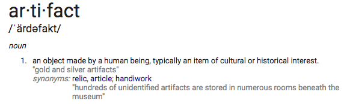
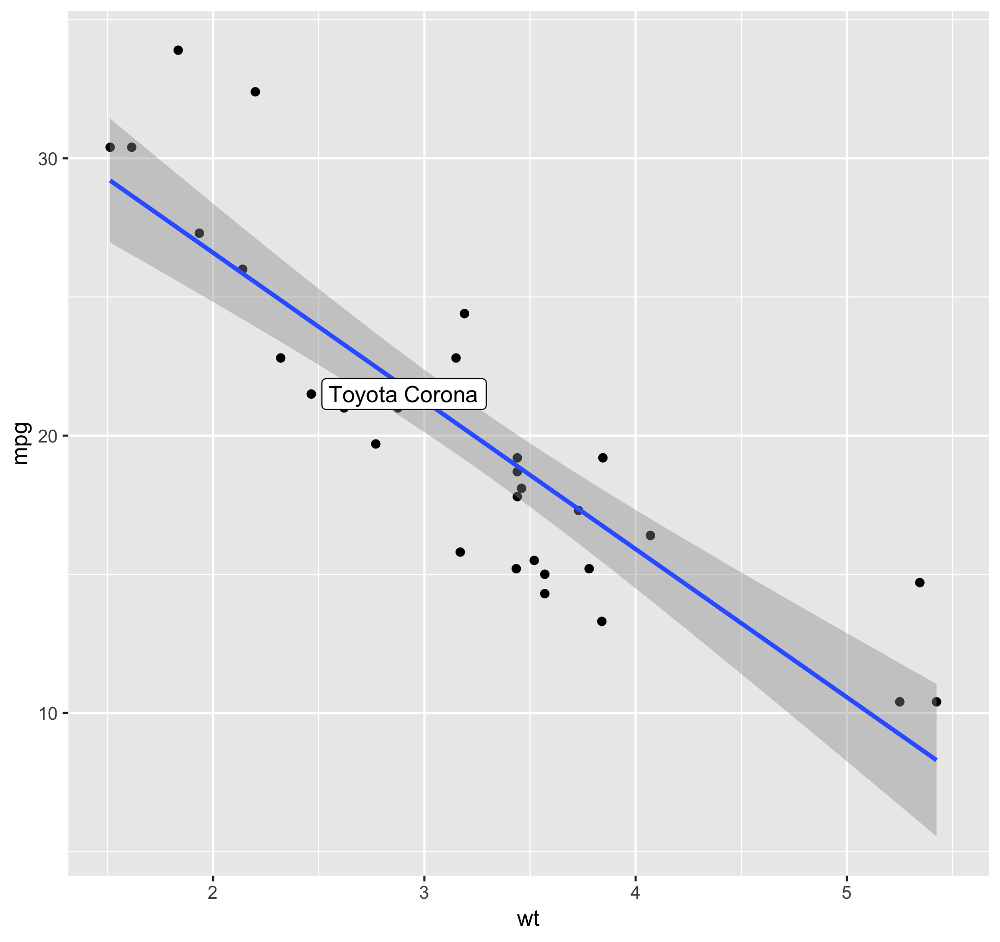
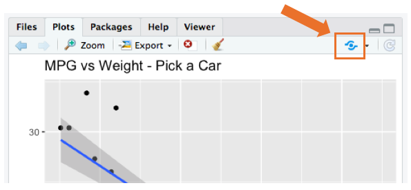

<style>
table, th, td {
    text-align: left;
}

td { 
    width: 20%;
}
</style>
```{r setup, include=FALSE}
library(learnr)
library(tidyverse)
knitr::opts_chunk$set(echo = FALSE)
```


## Data Products



Are you **mining**, or are you **manufacturing**?

### What kind of artifacts are you producing?

### 

* Plots
* Shiny apps 
* R Markdown
* Models
* API's
* Presentations

### Considerations for how we deliver these

###

* Plots
    * email
    * reports
    * web pages / blogs
* Shiny apps
    * web pages
    * dashboards
    * interactive tutorials
* Markdown
    * email
    * reports
    * web pages / blogs
    * dashboards
    * parameterized reports
* Models
    * reports
    * apis
* API's
    * web services
* Presentations
    * slides
    * what are we looking at? ([learnr](https://rstudio.github.io/learnr/index.html))
    
    
## Plots 

Example plot

{width=50% height=50%}


| DIY options | Example | Notes |
| -------- | ----- | ----- |
| Google Drive, etc | [google drive](https://drive.google.com/open?id=1Zrau2jDtnaTw2mWG1YDE8bZQbQJUWw2D) | Satisfactory for most applications |

| RStudio hosted options | Example  | Notes |
| -------- | ----- | ----- |
| Rpubs (free) | [Random car Web URL from RPubs](http://rpubs.com/dsdaveh/random_car) | public |

| RStudio Connect  |  | Notes |
| -------- | ----- | ----- |
| [Random car Web URL from Connect](https://connect.rstudioservices.com/dave/random_car/) | | Simplified access control |


To publish a plot from the RStudio IDE, select the _Publish Plot..._ icon
{width=50%}


```{r make_plot, exercise=TRUE, warning=FALSE, message=FALSE}
example <- mtcars %>% 
    mutate(name = rownames(.),
           label = NA)

#set.seed(1) 
random_pick <- sample(1:nrow(example), 1)
example[random_pick, "label"] <- example[random_pick, "name"]

example %>% ggplot(aes(wt, mpg)) +
    geom_point() +
    geom_smooth(method = 'lm') +
    geom_label(aes(label = label), hjust = "inward", nudge_x = 0.05) +
    ggtitle("MPG vs Weight - Pick a Car")
```

## Shiny

For examples of what you can do with Shiny check out 
[http://shiny.rstudio.com/gallery/](http://shiny.rstudio.com/gallery/)

###

### Example app (Quinoa Pi)
```{r quinoa_setup}
fluidPage(
sliderInput('nq', 'How much quinoa do you want to throw?',
            value = 110, min = 10, max = 10000, step = 10),

numericInput('nthrows', 'How many throws?',
             value = 1, min = 1, max = 100, step = 10),

actionButton('goButton', 'Throw'),
HTML(" "),
actionButton('resetButton', 'Reset History'),
    fluidRow(
        column(width = 6, plotOutput('image')),
        column(width = 6, plotOutput('hist'))
    )
)

```

```{r quinoa_throw, context="server"}
library(UsingR)
library(plotrix)
library(shiny)
library(glue)

throw.history <- numeric()
set.seed <- 1999
last.reset <- 0
n.throws <- 0
hide.quick.start <- 0
show.explanation <- 0

output$image <- renderPlot({
    if( input$resetButton > last.reset)  {
        isolate({ 
            throw.history<<-numeric()
            last.reset <<- input$resetButton
            n.throws <<- 0
        })
    }
    input$goButton
    isolate({
        n.throws <<- ifelse( n.throws < 0, 1, input$nthrows)
        for( throw in 1:n.throws) {
            
            x <- runif( input$nq )
            y <- runif( input$nq )
            
            r <- sqrt((x - .5)^2 +(y - .5)^2)
            nq.in <- r <= .5
            colr <- ifelse( nq.in, "red", "blue") #not used
            
            pi.est <- 4 * sum(nq.in) / input$nq
            throw.history <<- c(throw.history, pi.est)
        }
        
        text.obs <- sprintf("On the last throw, %d grains were thrown. \n%d landed in the circle.", input$nq, sum(nq.in))
        text.pi <- expression(pi[estimated] == 4 %*% frac(total.in.circle, total.thrown))
        text.result <- sprintf("= %.6f    (Error = %7.2f%%)", pi.est, -100*(1-pi.est/pi))
        par_orig <- par(mar=c(2,2,5,2))
        plot  ( x=c(-.1, 1.1, 1.1, -.1)
                ,y=c(-.1, -.1, 1.1, 1.1)
                , axes=FALSE, asp=1, type="n", xlab="", ylab="")
        mtext(line=3, text.obs)
        mtext(line=0, text.pi)
        mtext(line=-1, text.result)
        
        lines( x=c(0,1,1,0,0), y=c(0,0,1,1,0), col="blue")
        draw.circle(.5,.5,.5,nv=100,col="light blue", border="white")
        
        #brown.trans <- col2rgb("brown")  #165,42,42
        points(x,y, pch=19, col=rgb(165,42,42, 70,maxColorValue=255)) # col=colr to color the points

        par(par_orig)
     } ) #isolate
}, width=350, height=350)  #renderPlot

output$hist <- renderPlot({     
    input$goButton
    input$resetButton

    par_orig <- par(mar=c(2,2,7,2))
    n.throws <- length(throw.history)
    n.breaks <- ifelse(n.throws>35, 50, 10)
    pi.avg <- mean(throw.history)
    throw.hist <- hist(throw.history, 
                       breaks=n.breaks, 
                       main = "Estimate History", 
                       xlim = c(2.74, 3.54), 
                       xlab = expression(paste(pi, " estimates" )) )
    hist.max <- max(throw.hist$counts)
    history_text <- sprintf("Total number of throws: %d \n average estimate for pi=%.5f \n (Error = %7.4f%%)"
                          , n.throws, pi.avg
                          , -100*(1-pi.avg/pi))
    mtext(line=0, history_text)
    lines(c(pi.avg, pi.avg), c(0, hist.max),col="red",lwd=4)
    text(pi.avg, hist.max*.9 , expression(pi[est.avg]), col="red", c(0,0))
    lines(c(pi, pi), c(0, hist.max),col="blue",lty=2, lwd=4)
    text(pi, hist.max*.8, expression(pi), adj=c(-1,0), col="blue")
    par(par_orig)
}, width=300, height=300)  #renderPlot

```


### How to deploy a shiny app

**Things to think about**  

* How will others get access to my server?
* What versions of R do I need?
* What packages / versions do I need?
* Who can access the app?
* Secure connections to data (passwords, etc.)?
* How many simultaneous users will I have?
* How much load might I put on the system?


| DIY options | Example | Notes |
| -------- | ----- | ----- |
| Shiny Server (open source) on a Linux server |  | Single threaded |
| RStudio IDE (open source) + Github | | R team deployment |


| RStudio hosted options | Example  | Notes |
| -------- | ----- | ----- |
| Shinyapps.io | [Quinoa Pi](https://dsdaveh.shinyapps.io/QuinoaPi/)  | Free and professional tiers  |
|   |   | Data security considerations |

| Professional Options  | Example | Notes |
| -------- | ----- | ----- |
| Shiny Server Pro |  | IT deploys |
| RStudio Connect | [Quinoa Pi](https://connect.rstudioservices.com/dave/quinoapi/) | Data scientist deploys |


For more info: https://shiny.rstudio.com/deploy/

### Deployment Example


## R Markdown

### There's R Markdown... (Template Example)

#### R Markdown

This is an R Markdown document. Markdown is a simple formatting syntax for authoring HTML, PDF, and MS Word documents. For more details on using R Markdown see <http://rmarkdown.rstudio.com>.

When you click the **Knit** button a document will be generated that includes both content as well as the output of any embedded R code chunks within the document. You can embed an R code chunk like this:

```{r cars, echo=TRUE}
summary(cars)
```

#### Including Plots

You can also embed plots, for example:

```{r pressure, echo=FALSE}
plot(pressure)
```

Note that the `echo = FALSE` parameter was added to the code chunk to prevent printing of the R code that generated the plot.

### And then there's **R Markdown**!!


### Resources

https://rmarkdown.rstudio.com  
https://bookdown.org/yihui/rmarkdown/  

{width=25% height=45%}

### Leaflet example

```{r out.width='100%', echo=FALSE}
library(leaflet)
l1 <- -121.935
l2 <- 37.3495
leaflet() %>% addTiles() %>%
  setView(l1, l2, zoom = 17) %>%
  addPopups(
    l1, l2,
    'You are here <b>Leavey Event Center</b>'
  )
```

### Parameterized Markdown

* An example of a [static report](http://colorado.rstudio.com:3939/forecast/)
* An example of a [parameterized report](http://colorado.rstudio.com:3939/connect/#/apps/1541/access/1702)

### Flex Dashboards

* An example of a [flexdashboard](http://colorado.rstudio.com:3939/forecast-flex/)

## Models / API's

Use Plummer to expose your functions as API's

{width=15% height=15%}
{width=15% height=15%}

```
#* @apiTitle Widget Forecast

#* Return a forecast for one of the widget products
#* @param series Product name (Basic, Killdozer, Master, All)
#* @param forecast_duration Forecast duration (numeric between 3 and 15)
#* @get /forecast
#* @html

function(series = "All", forecast_duration = 9) {
  
  # load data in 'global' chunk so it can be shared by all users of the dashboard
  monthly_widget_sales <- read_csv("mvd-data/widget_sales_monthly.csv") # Read in the data
  monthly_widget_sales_gathered <- gather(monthly_widget_sales, key='product', value="sales", 
                                          widget_basic_sales, 
                                          widget_killdozer_sales, 
                                          widget_master_sales, total_sales) %>%
    arrange(date) # Gather all the product info into a single column arranged 
... <code removed for brevity> ...
  result <- format_html(table_output)
  return(result)
}
```

Try it out in Googlesheets:

* open a Google Sheet
* Select any Cell 
* =importxml("http://colorado.rstudio.com/rsc/content/1391/forecast?forecast_duration=9&series=All", "//tr")

In Excel: _Data_ > _From Web_  http://colorado.rstudio.com/rsc/content/1391/forecast?forecast_duration=9&series=All


## Presentations / Tutorials

### Powerpoint

```
---
title: "Widget Forecast PowerPoint"
author: "Data Scientist Dave"
resource_files:
 - ./digicomp-template.pptx
output:
  powerpoint_presentation:
    reference_doc: ./digicomp-template.pptx
---
```

### Learnr Tutorials

This document

### Thank You
