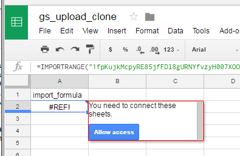
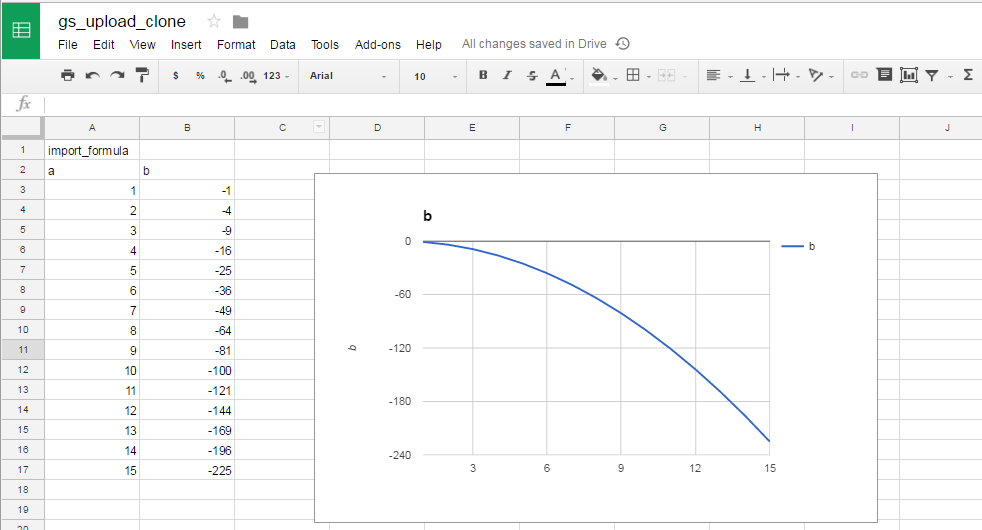

## Overview

This notebook runs through the process of updating the data in sheet in automated way, such that pivot tables and charts are preserved.  The basic steps are:

+ Creating an example gSheet
+ Create a clone of the first sheet that updates with changes
+ Add any charts or pivots to the clone
+ Update the original sheet

If this process seems a little more complex than you'd expect, here's why:
Although there are API's available to update the original sheet directly using a cell aware function, eliminating the need for a second sheet, the API's are very slow and not practical for many rows (> 1000).  The alternative API's that replace the data are much faster, but do not preserve charts, pivots, or secondary sheets that have been added to the Spreadsheet.

```{r message=FALSE, warning=FALSE}
library(googlesheets)
library(dplyr)

src_name <- 'gs_upload_src'
clone_name <- 'gs_upload_clone'
```

## Setup

Authenticate using a cached token if it exists, or skip this chunk below and run this command to authenticate via the browser:

`gs_auth(new_user = TRUE, cache = FALSE )`

```{r message=FALSE}
# authenticate and create a simple spread sheet
gs_auth()  #(new_user = TRUE, cache = FALSE ) to force reauthentication
```
```{r}
gd_user()
```

Create some arbitrary data in a sheet titled ``r src_name``.  We'll also create ``r clone_name`` that we'll use to clone the data using the steps below.

```{r}
data1 <- data.frame( a = 1:10, b = (1:10)**2) 
ss_src <- gs_new(title = src_name, input = data1)

# create a spread sheet to import this data 
import_formula <- sprintf('=IMPORTRANGE("%s", "A1:Z1000")', ss_src$sheet_key)
ss_clone <- gs_new(title = clone_name, input = data.frame(import_formula))

gs_browse(ss_clone)
```

[Link to original spreadsheet](`r ss_src$browser_url`)
[Link to cloned spreadsheet](`r ss_clone$browser_url`)

**MANUAL STEPS** (give it a few secs to load completely)  

1 -  Click on the #REF! cell -- this should raise dialogue: "You need to connect these sheets."  
2 -  Click on "Allow access" -- this should result in data1 appearing starting in cell A2  
3 -  Create a pivot or chart on this data



  


Now we'll update the original spread sheet and open it to observe the change.

```{r}

# write out a .csv file of data to replace original with
data2 <- data.frame( a = 1:15, b = -1 * (1:15)**2)  #any visual change will do
tmp_file <- 'ssdata_tmp.csv'
write.csv(data2, file=tmp_file, row.names = F)

ss <- gs_upload(tmp_file, sheet_title = 'gs_upload_src', overwrite = T)
gs_browse(ss)
```

Note that it can take several minutes for the import to update in the cloned sheet.

Here's a look at the cloned sheet after the update:  


