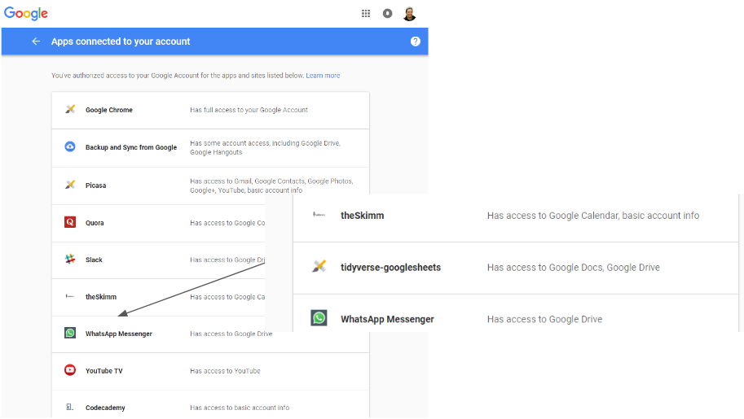

#  {.tabset .tabset-fade .tabset-pills}

Before we start, let's acknowledge the extensive documentation on [Managing OAuth Tokens](https://rawgit.com/jennybc/googlesheets/master/vignettes/managing-auth-tokens.html) from the package authors. (*Thank you, thank you, thank you* [\@JennyBryan](https://twitter.com/JennyBryan))

Although getting started on googlesheets was trivial, I did have to jump a few hurdles on the way to a production implementation.  This notebook highlights those and the solutions I found along the way.

**Authorization issues**  

1. Server Authentication: When R/RStudio is not running locally (for example RStudio Server on Azure or AWS)  
2. Service Accounts: When you want to authenticate as a different user (eg. Shiny)  
3. Security Concerns: When your IT department complains that you enabled the 'tidyverse-googlesheets' app  
4. Transferring ownership to another user from within a corporate Google account  

**Data Revision Issues (updates/edits)**  

5. You're updating a really large dataset (response times)  
5.b ... and you have a pretty chart you want to keep  

## >

 ^--- Click on the tabs/pills above to step through each potential gotcha ---^

## 1. Server Authentication

Let's say I'm interacting with RStudio server off in the cloud [(in the Azure sky)](http://52.183.92.138:8787/).  Then authorizing interactively takes me to the Google authentication page properly, but gets lost on the round trip.

```{r include=FALSE}
options(httr_oob_default=FALSE)
gs_deauth(verbose=FALSE)
```
```{r}
library(googlesheets)
gs_auth()
```

The R process hangs here because the browser redirect fails:


We can work around this by setting an option to allow cutting and pasting the request/response from a local browser with the following option:

```{r}
options(httr_oob_default=TRUE)
gs_auth()
```

 

## 2. Service Accounts

Maybe we need to forego interactivity altogether, either because we're using a service account that the end user doesn't have access to, or we want to run in batch mode (asynchronously).

This is well documented within the package, but here's the tl;dr version

```{r}
gs_auth()
token_file <- 'dah-token.rds'
saveRDS(gd_token(), file=token_file)

#to test
gs_deauth(verbose=FALSE)
gs_auth(token=token_file, cache=FALSE)
```

So if I want to authenticate as a different user, I just need have a token that's been authenticated by that user

```{r}
gd_user()
gs_auth(new_user=TRUE, token='nwu-token.rds', cache=FALSE)
gd_user()
```

## 3. Security Concerns

So now that we're getting into impersonating others and caching authorization tokens (refresh tokens actually, but still...) we should be sitting up a little straighter

At the very least, your `.gitignore` file should have these lines in it so you don't accidently publish this info on GitHub:

```
.httr-oauth*
*-token.rds
```

But that probably won't be enough for an IT department in a large company that has Google Apps.  That's because these apps can be tunnels to corporate IT.  You've probably given access to multiple apps to access your Google accounts.  Do you remember who and what access you granted?  You can find out by browsing to https://myaccount.google.com/permissions.

Here's mine, first before granting permissions to Google and then afterwards:



To them it will be "who the heck is 'tidyverse'"

Solve that by creating a new client id at https://console.developers.google.com and specifying the credentials during authentication


```{r}
client_id <- '654408901126-6ascnjld6hlpgcn4mcgpvpneh6vptvmg.apps.googleusercontent.com'
client_secret <- 'Sk7Nxc5jQ63zgYiRHulWvC0d'
gs_auth(new_user=TRUE, key=client_id, secret=client_secret, cache=FALSE)
```

Now Google authenticates with whatever you used to register the app in the console and negotiate a safe/accepted name with your IT department (the name of your CIO's dog?)


