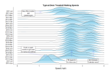
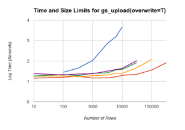

# googlesheets - joys and gotchas

Presented at Bay Area R Users Group - [BARUG, August 8^th^, 2017](https://www.meetup.com/R-Users/events/242005538/)

+ [Desk Treadmill Data Analysis](https://rawgit.com/dsdaveh/talks-and-tutorials/master/googlesheets_BARUG_Presentation/treadmill_notebook.nb.html) - a motivating example  . . .    
+ [Authentication and Performance Considerations](https://rawgit.com/dsdaveh/talks-and-tutorials/master/googlesheets_BARUG_Presentation/gsheet_oauth.nb.html)  . . . . . .    
    + [updating large datasets](https://rawgit.com/dsdaveh/talks-and-tutorials/master/googlesheets_BARUG_Presentation/gs_upload_notebook.nb.html)

 
.  
.

https://github.com/dsdaveh/talks-and-tutorials/tree/master/googlesheets_BARUG_Presentation

  
| Dave Hurst |    |
|---|----|
| email | david@hurst.com |
| LinkedIn | https://www.linkedin.com/in/davehurst/ |
| GitHub | https://github.com/dsdaveh |
| Twitter | @dahurst79 |

