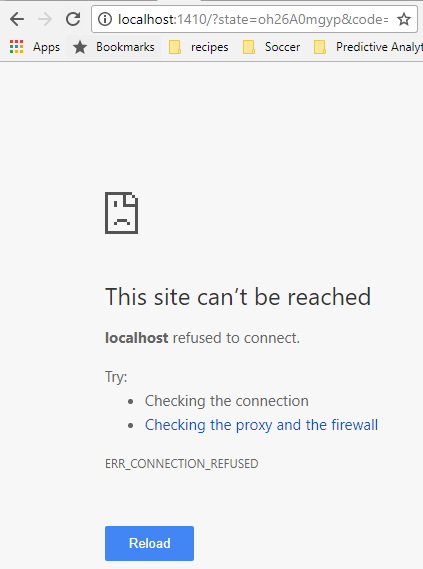
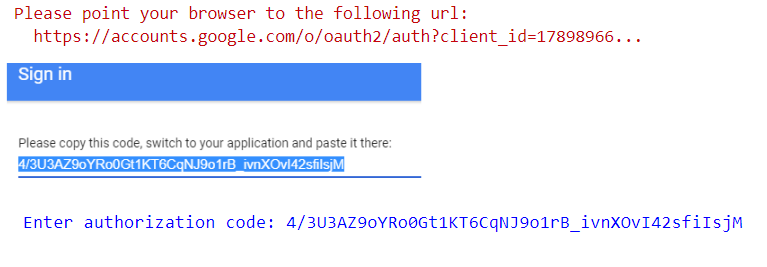
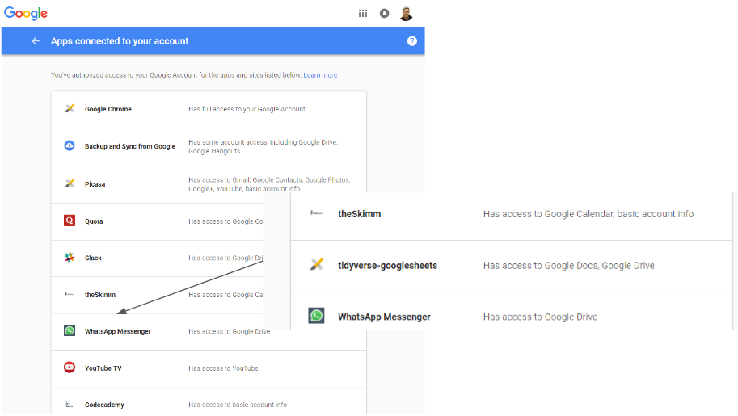
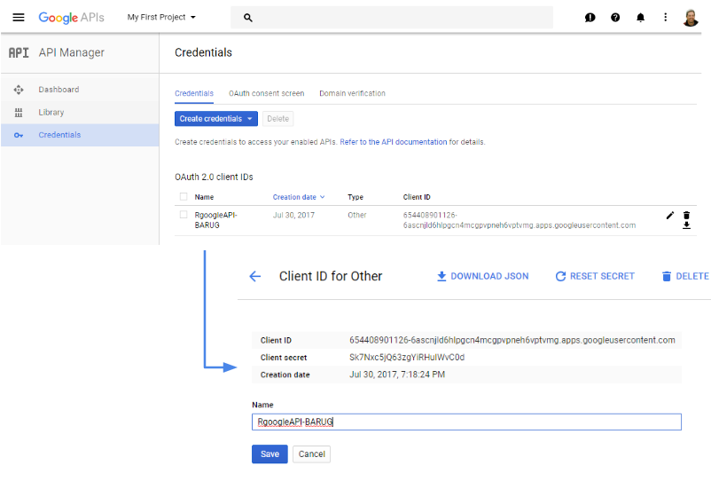
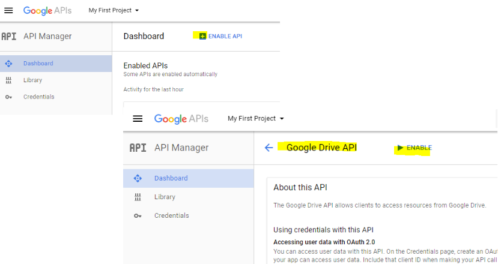
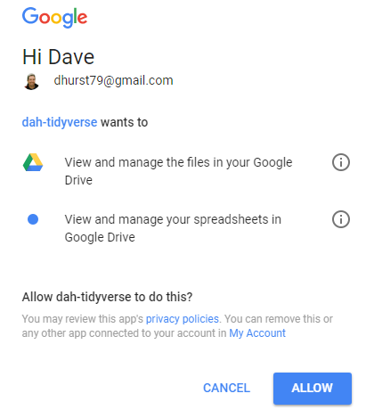
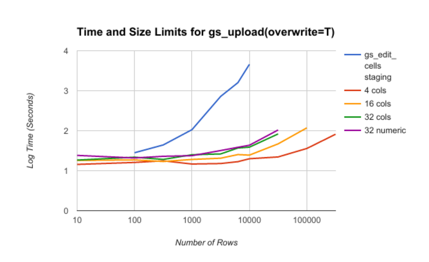

#  {.tabset .tabset-fade .tabset-pills}

Before we start, let's acknowledge the extensive documentation on [Managing OAuth Tokens](https://rawgit.com/jennybc/googlesheets/master/vignettes/managing-auth-tokens.html) from the package authors. (*Thank you, thank you, thank you* [\@JennyBryan](https://twitter.com/JennyBryan))

Although getting started on googlesheets was trivial, I did have to jump a few hurdles on the way to a production implementation.  This notebook highlights those and the solutions I found along the way.

**Authorization issues**  

1. Server Authentication: When R/RStudio is not running locally (for example RStudio Server on Azure or AWS)  
2. Service Accounts: When you want to authenticate as a different user (eg. Shiny)  
3. Security Concerns: When your IT department complains that you enabled the 'tidyverse-googlesheets' app  
4. Transferring ownership to another user from within a corporate Google account  

**Data Revision Issues (updates/edits)**  

5. You're updating a really large dataset (response times)  
5.b ... and you have a pretty chart you want to keep  

---

## >

 ^--- Click on the tabs/pills above to step through each potential gotcha ---^

## 1. Server Authentication

Let's say I'm interacting with RStudio server off in the cloud [(in the Azure sky)](http://52.183.92.138:8787/).  Authorizing interactively takes me to the Google authentication page properly, but gets lost on the round trip.


```{r include=FALSE}
options(httr_oob_default=FALSE)
gs_deauth(verbose=FALSE)
```
```{r}
library(googlesheets)
gs_auth()
```

The R process hangs here because the browser redirect fails:



We can work around this by setting an option to allow cutting and pasting the request/response from a local browser with the following option:

```{r}
options(httr_oob_default=TRUE)
gs_auth()
```

 

## 2. Service Accounts

Maybe we need to forego interactivity altogether, either because we're using a service account that the end user doesn't have access to, or we want to run asynchronously -- think R Markdown docs, or scheduled runs

This is well documented within the package, but here's the tl;dr version

```{r}
gs_auth(new_user=TRUE, cache=FALSE)
token_file <- 'dah-token.rds'
saveRDS(gd_token(), file=token_file)

#to test
gs_deauth(verbose=FALSE)
gs_auth(token=token_file)
```

So if I want to authenticate as a different user, I just need have a token that's been authenticated by that user (below I'll use a token file that was created in a different session)

```{r}
gd_user()
gs_auth(new_user=TRUE, token='nwu-token.rds', cache=FALSE)
gd_user()
```

## 3. Security Concerns

So now that we're getting into impersonating others and caching authorization tokens (refresh tokens actually, but still...) we should be sitting up a little straighter.

Not all of this can be found in the docs, and in any case there are several steps, so here's the **BLUF** followed by detailed steps:  

+ use .gitignore to prevent publishing tokens
+ register your own trusted app name at https://console.developers.google.com
+ while you're there make sure thr Drive API app is enabled

---

**Details**

At the very least, your `.gitignore` file should have these lines in it so you don't accidently publish this info on GitHub:

```
.httr-oauth*
*-token.rds
```

But that probably won't be enough for an IT department in a large company that has Google Apps.  That's because these apps can be tunnels to corporate IP.  You've probably given access to multiple apps to access your Google accounts.  Do you remember who and what access you granted?  You can find out by browsing to https://myaccount.google.com/permissions.

Here's mine, first before granting permissions to Google and then afterwards:



To them it will be "who the heck is 'tidyverse'"

Solve that by creating a new client id at https://console.developers.google.com and specifying the credentials during authentication



You also need to have the Drive API enabled for this to work ([issue #288](https://github.com/jennybc/googlesheets/issues/288)) 



```
client_id <- '654408901126-6ascnjld6hlpgcn4mcgpvpneh6vptvmg.apps.googleusercontent.com'
client_secret <- 'Sk7Nxc5jQ63zgYiRHulWvC0d'
gs_auth(new_user=TRUE, key=client_id, secret=client_secret, cache=FALSE)
```

Now Google authenticates with whatever you used to register the app in the console and negotiate a safe/accepted name with your IT department.



```{r include=FALSE}
gs_auth(token='dah-token.rds')
```

## 4. Transferring Ownership

Now we've got the ability to authenticate as a trusted user and create a google sheet. We might want to assign ownership, or at least edit rights back to the user.  Enter `googledrive` ... well almost enter.  You'll need to install it from github

```
install.packages("devtools")
devtools::install_github("tidyverse/googledrive")
```

```{r}
library(tidyverse)
library(googledrive)
```

We need to authenticate, since googledrive uses a different client id.  At some point I assume all the google*** packages use a single tidyverse api?

```
drive_token <- drive_auth(cache=FALSE)
saveRDS(drive_token, file = 'dah_drive-token.rds')
```
```{r}
get_drive_perms <- function(file) {
    perm_list <- file$drive_resource[[1]]$permissions
    perms <- tibble(seq = 1:length(perm_list))
    perms$emailAddress <- purrr::map_chr(file$drive_resource[[1]]$permissions, 'emailAddress')
    perms$displayName <- purrr::map_chr(file$drive_resource[[1]]$permissions, 'displayName')
    perms$type <- purrr::map_chr(file$drive_resource[[1]]$permissions, 'type')
    perms$role <- purrr::map_chr(file$drive_resource[[1]]$permissions, 'role')
    perms$perm_id <- purrr::map_chr(file$drive_resource[[1]]$permissions, 'id')
    return(perms)
}
drive_auth(new_user = T, token='dah_drive-token.rds')
new_sheet <- gs_new("anything")
handle <- drive_get(as_id(new_sheet$sheet_key))
get_drive_perms(handle)
drive_share(handle, emailAddress = 'o9e4g9@u.northwestern.edu', role='reader', type = 'user')
#drive_share(handle, emailAddress = 'davehurst.dev@gmail.com', role='owner', type = 'user' )
handle <- drive_get(as_id(new_sheet$sheet_key))
get_drive_perms(handle)
drive_rm(handle)
```

*Caveat* - I'm still working through googledrive, so the above may not be the most efficient example

If you don't want to (or can't) load the dev version, some of what we need is buried in googlesheets (not exported, so you'll need the triple-colon).  You may be able take advantage of that, but be aware that it is unsupported and will probably be obsoleted by the `googledrive` package (*"You'll poke your eye out, kid"*).  For now, it seems a little more stable, but once googledrive is in CRAN, I'd migrate to that.


```{r message=FALSE}
new_sheet <- gs_new("anything")
googlesheets:::gs_perm_ls(new_sheet)
googlesheets:::gs_perm_add(new_sheet, type = 'user', email = 'o9e4g9@u.northwestern.edu', role='reader')
googlesheets:::gs_perm_add(new_sheet, type = 'user', email = 'davehurst.dev@gmail.com', role='owner', with_link = FALSE)
googlesheets:::gs_perm_ls(new_sheet)
```
```{r, include=FALSE}
##cleanup
gs_auth(new_user = T, token = 'dev-token.rds', verbose = FALSE)
gs_delete(new_sheet)
gs_auth(new_user = T, token = 'dah-token.rds', verbose = FALSE)
```

Note that things get trickier within corporate domains, as other permissions come into play.  You may need to get into deep waters on Web API's with tools like [Fiddler](https://www.google.com/url?sa=t&rct=j&q=&esrc=s&source=web&cd=1&cad=rja&uact=8&ved=0ahUKEwjOks_yqr7VAhWK8CYKHbiXA6UQFggoMAA&url=http%3A%2F%2Fwww.telerik.com%2Ffiddler&usg=AFQjCNGY5eqyh8uRUDSYsPDDbTNL4aUgVw) to find addition settings that are required.  For example, I found the `with_link` parameter to be required in our corporate domain, but not for the public Google domain.  Pull out your compass, you're sailing into uncharted waters.  *Bon Voyage!*

## 5. Performance

+ How large can my datasets be?
+ What if my edits are taking too long?

Let's start with some definitions of dataset size, which are somewhat arbitrary, but grounded in observations from the chart below:

`Small data < 2000 rows < Large data < 100,000 rows < Too big`



The rogue blue line above is the performance time for the `gs_edit_cells()` and gets unreasonably slow pretty quickly.  The Y-Axis is logarithmic, so 1000 rows using this method takes 10^2^ (< 2 mins), while 10,000 rows takes 10^3.6^ (> 1hr).  Instead we can use gs_upload(overwrite=TRUE) to get much better performance -- approximately 2 mins for 100,000 rows depending on the number and types of columns.  The API will fail if the data gets too large (indicated roughly by the curve endpoints).

Note that all this is a moving target, so again pay careful attention to the date at the top, and run your own tests.  At the time of this writing, the googlesheets package is slated for an update to the latest Google API v4, which should provide a significant boost.

**gs_edit_cells vs gs_upload(overwrite=TRUE)**

So why not just always use  `gs_upload`?  Because sadly gs_upload will stomp on your Google Sheet.  Those extra worksheets, charts and pivot tables?  Gone, gone and gone :-(

With a little more work though, you can preserve edits and augmentations by linking the data from the sheet that googlesheets updates, and making changes to that linked sheet.  The key to this is the `IMPORTRANGE` function in Sheets, I've got a detailed write up on that here: [Automated Google Sheets updates for Charts and Pivot Tables](https://rawgit.com/dsdaveh/talks-and-tutorials/master/googlesheets_BARUG_Presentation/gs_upload_notebook.nb.html)

